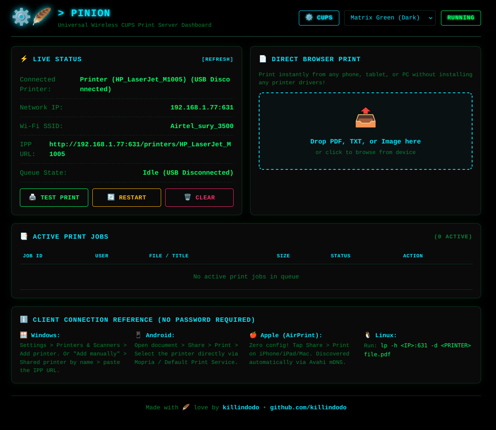
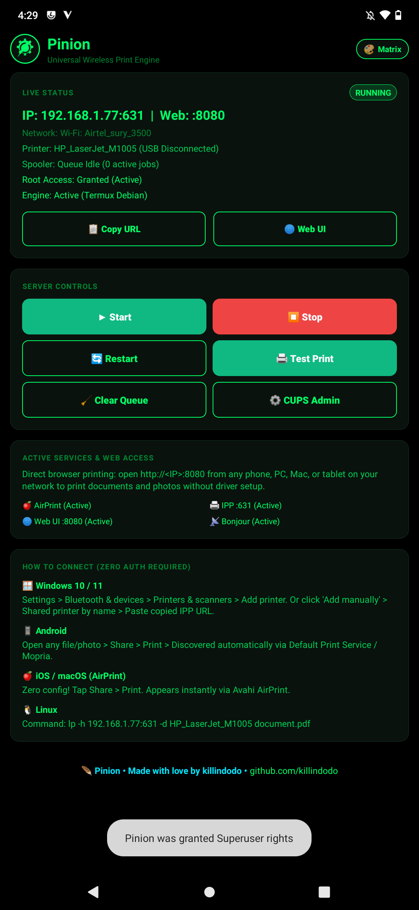
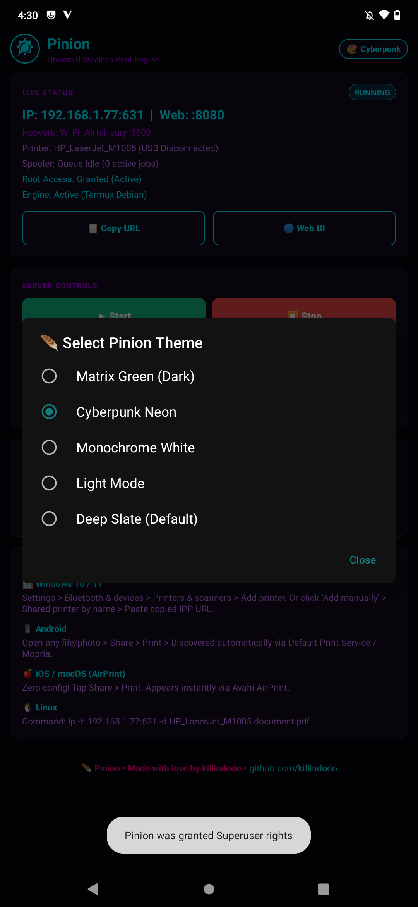
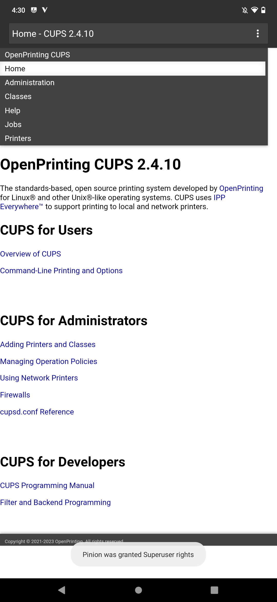
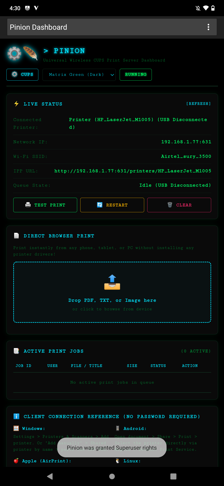
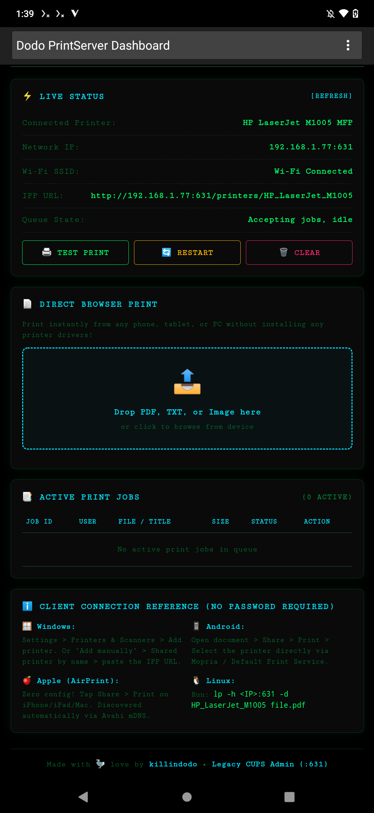
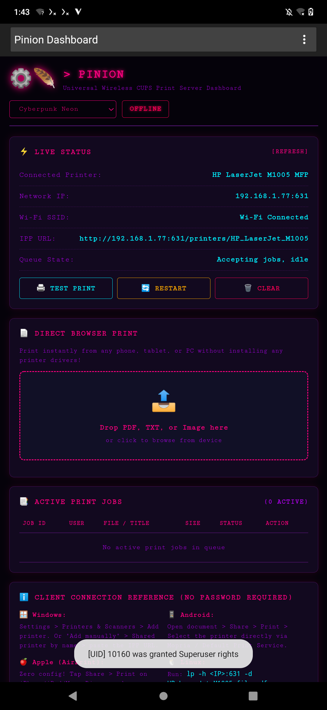

<p align="center">
  
</p>

<h1 align="center">Pinion ⚙️🪶</h1>
<h3 align="center">Universal Wireless Print Engine & Server for Android</h3>

<p align="center">
  <b>Turn any rooted Android device into a standalone, enterprise-grade network print server.</b><br>
  Native support for <b>Apple AirPrint</b>, <b>Android Mopria / Default Print Service</b>, <b>Windows IPP</b>, and <b>Linux CUPS</b>.<br>
  Engineered for USB OTG printers across PostScript, PCL, and host-based GDI devices.
</p>

<p align="center">
  
  
  
  
  
</p>

<p align="center">
  Developed with 🪶 by <a href="https://github.com/killindodo"><b>killindodo</b></a>
</p>

---

## 🌟 Visual Showcase

### Desktop Web UI Dashboard (`:8080`)
Direct browser drag-and-drop document & photo printing without client-side driver installations:
<p align="center">
  
</p>

### Native Android Control Application
Lightweight (<170 KB), battery-optimized native controller with live telemetry, spooler controls, and 5 cyber themes:

| Matrix Green (Active) | Cyberpunk Neon | Deep Slate | Monochrome Terminal |
| :---: | :---: | :---: | :---: |
|  |  |  |  |

### Responsive Mobile Browser Web UI
Print on the go from any smartphone or tablet browser on the local Wi-Fi:

<p align="center">
  
  &nbsp;&nbsp;&nbsp;&nbsp;
  
</p>

---

## ⚡ Key Capabilities

- **Zero-Driver Universal Discovery**: Broadcasts zero-configuration mDNS records via Avahi (`_ipp._tcp`, `_printer._tcp`, `_pdl-datastream._tcp`). Instant discovery on iOS, macOS, Windows 10/11, and Android.
- **Native AirPrint & Mopria**: Tap **Share > Print** on any iPhone, iPad, Mac, or Android device — jobs route natively to your USB printer.
- **Modern Responsive Web UI (`:8080`)**: Clean browser dashboard featuring drag-and-drop file upload, copies counter, real-time spooler telemetry, and 1-click job cancellation.
- **Host-Based & GDI Support**: Deep driver integration with Foomatic `foo2xqx`/`foo2zjs` and HPLIP for budget laser printers (HP LaserJet 1000/1005/1018/1020, Canon, Brother, Epson).
- **1-Click In-App Engine Installer**: Directly downloads and flashes the `pinion-core.zip` Magisk module via root in the background.
- **Micro-Footprint Controller**: Native Java Android APK is under 170 KB with zero bloatware or background battery drain.
- **WakeLock Protection**: Prevents CPU deep sleep while print server daemons are running.

---

## 🚀 Quick Start & Engine Setup

Pinion requires root access and the background print engine (CUPS, Avahi, Python 3, and printer drivers).

### Option 1: In-App 1-Click Install (Recommended)
1. Install and launch **[PrintServer-Root.apk](https://github.com/killindodo/pinion/releases)** on your rooted Android device.
2. Grant Root permissions when prompted by Magisk / KernelSU / APatch.
3. The app detects that the engine is missing and displays **SETUP NEEDED**.
4. Tap **⚡ Install Print Engine (Magisk Module)**.
5. Pinion will download `pinion-core.zip` directly from GitHub releases and flash it via Magisk root automatically.
6. Connect your printer via USB OTG and tap **▶ START**!

### Option 2: Flash Magisk Module Manually
1. Download `pinion-core.zip` from the latest [GitHub Releases](https://github.com/killindodo/pinion/releases).
2. Open the **Magisk** (or KernelSU / APatch) app.
3. Go to **Modules** > **Install from storage** and select `pinion-core.zip`.
4. Launch Pinion and tap **▶ START**.
5. *See the [Magisk Integration Guide](docs/MAGISK_GUIDE.md) for full details.*

### Option 3: Termux Debian Fallback
If you prefer running inside a user-managed Termux container:
```bash
pkg update && pkg install -y proot-distro
proot-distro install debian
proot-distro login debian -- apt update
proot-distro login debian -- apt install -y cups cups-client cups-filters avahi-daemon python3 printer-driver-foo2zjs hplip
```
Pinion automatically detects the Termux container and starts seamlessly.

---

## 💻 Client Connection Guides

No passwords or client drivers required. Connect to the same Wi-Fi network as the Pinion server.

| Client OS | Discovery Method | Manual IPP Address |
|---|---|---|
| **Windows 10 / 11** | Auto-detected via mDNS | `http://<DEVICE_IP>:631/printers/<PRINTER_NAME>` |
| **Apple iOS / iPadOS** | Native AirPrint | Automatic (Share > Print) |
| **Apple macOS** | Bonjour / AirPrint | Automatic in Printers & Scanners |
| **Android** | Default / Mopria Print Service | Automatic in Share > Print |
| **Linux** | CUPS / Avahi | `lp -h <DEVICE_IP>:631 -d <PRINTER_NAME> file.pdf` |
| **Any Web Browser** | Web UI Dashboard | `http://<DEVICE_IP>:8080` |

📖 *For comprehensive platform-by-platform setup tutorials, read the [Client Connection Guide](docs/CLIENT_SETUP.md).*

---

## 🖨️ Supported Printers

Pinion supports a wide variety of USB printers:
- **Standard PostScript & PCL Printers**: HP, Canon, Brother, Epson, Ricoh, Lexmark.
- **Host-Based GDI Laser Printers**: HP LaserJet 1000, 1005, 1018, 1020, M1005 MFP, Canon LBP series, Samsung ML series.
- **Thermal POS Printers**: 58mm / 80mm ESC/POS receipt printers via port 9100.

📖 *See the full list and firmware instructions in the [Supported Printers & Driver Matrix](docs/SUPPORTED_PRINTERS.md).*

---

## 📐 Architecture & System Daemons


Pinion coordinates the following services under root:
- **`cupsd`**: Core print scheduler, rasterizer filters, and IPP 2.0 implementation.
- **`avahi-daemon`**: Multicast DNS responder announcing AirPrint and IPP service records.
- **`printserver-webui.py`**: Lightweight Python HTTP server handling browser uploads and CUPS queue status.
- **`start-printserver.sh`**: Automates USB devnode permissions (`0666`), chroot mounts, and daemon supervision.

📖 *Read the complete technical specification in [Architecture & Specifications](docs/ARCHITECTURE.md).*

---

## 🛠️ Building & Testing from Source

### Prerequisites
- Android SDK Build-Tools (v30+) & `apksigner`
- JDK 17+
- Python 3.8+
- Bash & Zip utilities

### Build APK
```bash
chmod +x build.sh
./build.sh
```
The aligned and signed production APK will be generated at:
```text
build/out/PrintServer-Root.apk
```

### Build Magisk Module
```bash
cd magisk
chmod +x build-module.sh
./build-module.sh
```
The flashable zip will be generated at:
```text
build/out/pinion-core.zip
```

### Run Test Suites
```bash
# Run Python Web UI & security test suite (22 tests)
python3 -m unittest discover -s tests -v

# Run Shell & script integrity test suite (15 tests)
bash tests/test_shell_scripts.sh
```

---

## 📚 Documentation Index

- [Magisk & KernelSU Integration Guide](docs/MAGISK_GUIDE.md)
- [Architecture & Technical Specifications](docs/ARCHITECTURE.md)
- [Client Connection Guide (Windows, Mac, iOS, Android, Linux)](docs/CLIENT_SETUP.md)
- [Supported Printers & Driver Matrix](docs/SUPPORTED_PRINTERS.md)

---

## 📄 License & Author

- **Author**: Developed and maintained with 🪶 by [killindodo](https://github.com/killindodo).
- **License**: Released under the [MIT License](LICENSE).
