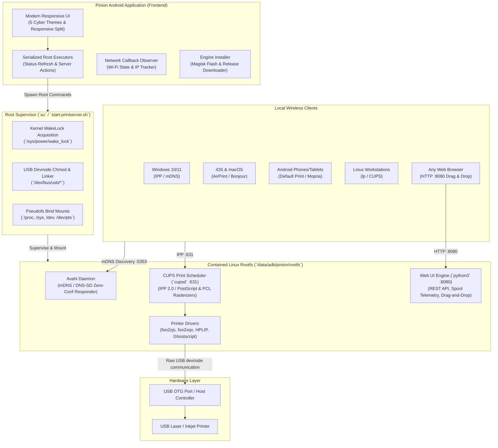

# Pinion Architecture & Technical Specifications ⚙️📐

This document outlines the software architecture, daemon coordination, process isolation, and network protocol specifications of the **Pinion Universal Wireless Print Engine**.

---

## 1. System Architecture Diagram



---

## 2. Component Breakdown

### 2.1 Native Android Frontend (`com.killindodo.printserver`)
- **Language**: Java 17 / Android SDK (Minimal footprint, zero heavyweight third-party runtime dependencies, total APK size <170 KB).
- **Threading Model**: 
  - `statusExecutor` (`Executors.newSingleThreadScheduledExecutor()`): Strictly serializes all root status queries (`lpstat`, `ps`, `lsusb`, `ip route`) to prevent thread racing and shell starvation.
  - `actionExecutor` (`Executors.newSingleThreadExecutor()`): Handles asynchronous Start/Stop/Install triggers without blocking the main UI thread.
- **Dynamic Theming**: 5 cyber and developer themes (**Matrix Green**, **Cyberpunk Neon**, **Deep Slate**, **Monochrome Terminal**, and **Clean Light**) persisted in `SharedPreferences`.
- **Responsive Layout**: Adapts automatically between vertical phone single-column layout and horizontal tablet multi-column telemetry view (`sw600dp`).

### 2.2 Root Supervisor & Environment Manager (`start-printserver.sh`)
- **Auto-Detection**: Automatically prioritizes rootfs locations:
  1. Magisk Overlay: `/data/adb/pinion/rootfs`
  2. Standalone Rootfs: `/data/local/pinion/rootfs`
  3. Termux PRoot: `/data/data/com.termux/files/usr/var/lib/proot-distro/installed-distros/debian`
- **Devnode Preparation**: Grants permissions (`0666`) to all devices on the USB bus to allow CUPS standard USB backend drivers to access hardware endpoints without requiring full root daemon execution.
- **Service Dependency Sequencing**:
  1. Starts D-Bus system bus daemon.
  2. Launches `avahi-daemon` and waits in an active polling loop until Avahi's socket is responsive.
  3. Launches `cupsd`.
  4. Launches `printserver-webui.py`.

### 2.3 Contained Linux Userspace Stack
- **CUPS (`cupsd`)**: Binds to `0.0.0.0:631` with permissive LAN access, IPP 1.1/2.0 conformance, and automatic queue management.
- **Avahi Daemon**: Broadcasts Service Discovery pointers:
  - `_ipp._tcp`: IPP printer discovery for macOS, iOS, Windows, and Linux.
  - `_printer._tcp`: LPD/LPR protocol service discovery.
  - `_pdl-datastream._tcp`: RAW port 9100 discovery for AppSocket clients.
- **Driver Matrix**:
  - `foo2zjs` & `foo2xqx`: Dedicated stream converters for host-based ZjStream and XQX printers (e.g., HP LaserJet 1000/1005/1018/1020).
  - `hplip`: Native HP PCL and PostScript driver backend.
  - Generic PostScript & PCL: Direct PDF rasterization via `ghostscript` and `cups-filters`.

---

## 3. Web UI Engine & REST API Specifications

The Web UI server (`server/printserver-webui.py`) is written in Python 3 using only the standard library (`http.server`, `subprocess`, `urllib`). It provides real-time browser printing and spooler telemetry without external pip dependencies.

### 3.1 REST API Endpoints

#### `GET /api/status`
Returns real-time telemetry of the server, printer, active network, and print queue.
- **Response Format**:
  ```json
  {
    "server": "running",
    "printer": "HP_LaserJet_M1005",
    "printer_status": "Idle",
    "usb_connected": true,
    "lan_ip": "192.168.1.77",
    "wifi_ssid": "HomeNetwork",
    "cups_port": 631,
    "raw_port": 9100,
    "avahi_running": true,
    "active_jobs": [
      {
        "id": "HP_LaserJet_M1005-42",
        "user": "anonymous",
        "size": "245k",
        "title": "Quarterly_Report.pdf",
        "state": "processing"
      }
    ]
  }
  ```

#### `POST /api/print`
Accepts a document via `multipart/form-data` and submits it directly to the active CUPS default printer via `lp`.
- **Allowed File Types**: `.pdf`, `.ps`, `.prn`, `.txt`, `.jpg`, `.jpeg`, `.png`
- **Parameters**:
  - `file`: Raw binary document content.
  - `copies`: Optional integer (defaults to `1`).
- **Response**:
  ```json
  {
    "success": true,
    "message": "Job submitted successfully",
    "job_id": "HP_LaserJet_M1005-43"
  }
  ```

#### `POST /api/cancel`
Cancels a specific print job.
- **Request Body**: `{"jobId": "HP_LaserJet_M1005-42"}`
- **Security Validation**: `jobId` is validated against strict alphanumeric and hyphen patterns (`^[A-Za-z0-9_-]+$`) to eliminate any possibility of command injection.

#### `POST /api/clear`
Clears all pending jobs in the spooler queue (`cancel -a`).

---

## 4. Security & Isolation Safeguards

1. **Strict Input Sanitization**:
   All shell interactions in both Java and Python pass arguments via structured argument arrays (`ProcessBuilder` and `subprocess.Popen(..., shell=False)`), preventing shell command injection attacks.
2. **Private Network Guardrails**:
   Web UI verifies request origins and restricts CORS headers, preventing malicious cross-origin websites from issuing print commands to local network printers.
3. **Safe Spool Storage**:
   Upload files are written to isolated temporary directories (`/data/local/tmp/` or rootfs `/tmp/`) with cryptographically strong UUID naming and immediate post-print unlinking.
